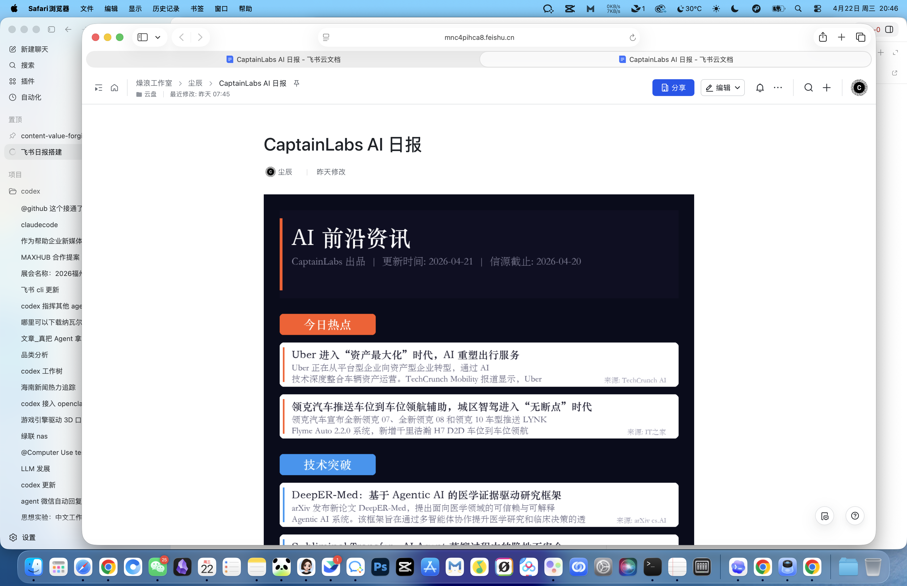

# AI Daily System 3.0.2

一个面向 **个人快速掌握 AI 资讯** 与 **微信群高质量分享** 的日报系统。

这个项目不是“媒体级内容工厂”，而是一个更务实的工作流：

- 先抓全
- 再筛重点
- 再输出两层结果

输出分成两层：

- **Hermes**：快报 / 提醒层
- **OpenClaw**：正式日报 / 留档层

---

## 这个项目解决什么问题

很多 AI 信息系统的问题不是“抓不到”，而是：

- 信息太多
- 噪音太大
- 大模型容易幻觉
- 输出结果不稳定

这个仓库提供的是一套更稳的思路：

- **SQLite** 做唯一主库
- **脚本** 负责事实层
- **大模型** 只负责判断、摘要、分析
- **飞书多维表** 只做观察面
- **正式日报** 和 **即时快报** 分层输出

---

## 核心特性

- **脚本优先**：标题、链接、来源、时间等事实字段全部脚本化保真
- **双层输出**：Hermes 负责快报，OpenClaw 负责正式日报
- **本地主库**：SQLite 是唯一 source of truth
- **飞书友好**：适合飞书私聊、群分享、文档沉淀
- **可迁移**：换信源后可适配其他行业信息系统
- **可复刻**：仓库内已包含公开版文档和最小可运行 scaffold

---

## 输出效果

### Hermes 快报

适合：

- 快速掌握一轮重点
- 个人阅读
- 群内轻量分享

### OpenClaw 正式日报

- [OpenClaw 正式日报示例（飞书 Docx）](https://mnc4pihca8.feishu.cn/docx/A36tdSntHoAFtGxdBetcygdDnQb?from=from_copylink)

适合：

- 正式阅读
- 群分享
- 留档
- 复盘

---

## 工作流机制

### Hermes

负责：

- 抓取 AI 资讯
- 清洗和去重
- 写入 SQLite
- 生成快报
- 发送后同步观察面

标准节奏：

- `07:30 / 11:30 / 15:30` 抓取
- `08:00 / 12:00 / 16:00` 发送快报

### OpenClaw

负责：

- 从 SQLite 主库读取候选
- 基于标题做正式选题
- 对少量入选条目读原文
- 生成飞书正式日报

标准节奏：

- `08:30` 生成正式日报

---

## 架构原则

### 1. SQLite 是唯一主库

- SQLite 保存全量事实
- 飞书多维表不是主库
- 所有链路都围绕 SQLite 运转

### 2. 事实层脚本化

脚本负责：

- 标题
- 链接
- 来源
- 时间
- 去重
- 候选池构建
- 状态写回

### 3. 判断层交给大模型

大模型只负责：

- 哪些值得关注
- 摘要
- 分析

不负责：

- 改写标题
- 生成链接
- 创造事实条目

### 4. 观察面是结果视图

飞书观察面展示的是：

- **这一轮实际处理并发出的结果**

不是“抓到就立刻显示”的原始素材池。

---

## 仓库内容

- [文档索引](docs/INDEX.md)
- [对外说明：这套系统是怎么搭的](docs/architecture/public-build-thinking-v3.0.2.md)
- [整体搭建方案](docs/architecture/system-overview-v3.0.2.md)
- [Hermes 操作手册](docs/architecture/hermes-setup-v3.0.2.md)
- [OpenClaw 操作手册](docs/architecture/openclaw-setup-v3.0.md)
- [参考信源（公开版）](docs/sources/reference-sources-v3.0.2.md)
- [输出效果展示](docs/showcase/output-examples-v3.0.2.md)
- [最小可运行 Scaffold](scaffold/README.md)

---

## 快速开始

如果你只是想先跑通一个最小版本，直接看：

- [scaffold/README.md](scaffold/README.md)

如果你想理解完整设计，再按这个顺序看：

1. [对外说明：这套系统是怎么搭的](docs/architecture/public-build-thinking-v3.0.2.md)
2. [整体搭建方案](docs/architecture/system-overview-v3.0.2.md)
3. [文档索引](docs/INDEX.md)

---

## 适用对象

- 想复刻 AI 日报系统的工程师
- 需要微信群/飞书分享的内容团队
- 只有有限 token 预算、希望“脚本多做、模型少做”的团队
- 想把同样思路迁移到其他行业情报系统的人

---

## 当前仓库定位

当前仓库是：

- **公开版文档**
- **公开版方法论**
- **最小可运行 scaffold**

不是你本地全部运行时代码的原样公开仓库。
